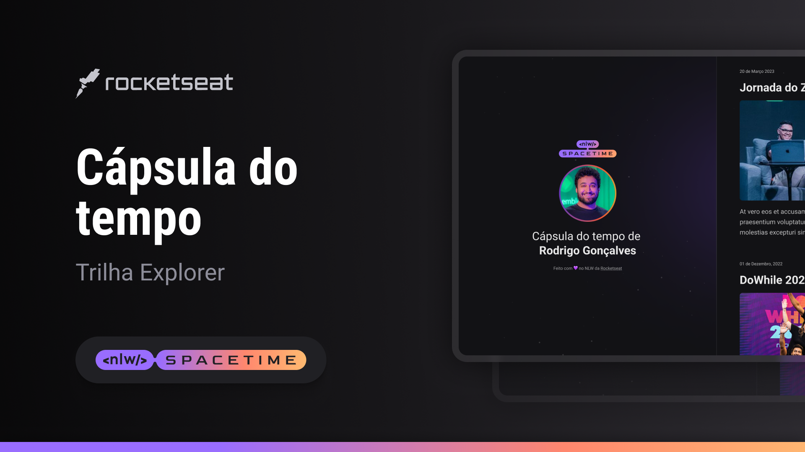

# NWL Spacetime Cápsula do Tempo
Website criado como caso de estudos da NWL Spacetime trilha Explorer da Rocketseat.

Você pode visitar o projeto [clicando aqui](https://rodrigoqueiroz12.github.io/nwl-spacetime/) 

## Instalação
1. Clone o repositório: `git clone https://github.com/rodrigoqueiroz12/nwl-spacetime.git`
2. Navegue até o diretório do projeto: `cd .\nwl-spacetime\`
3. Instale e execute a extensão Live Server.

## 💻 Projeto
Esse é um projeto Web Responsivo de uma cápsula do tempo para exibir memórias em uma timeline.

## 🚀 Tecnologias
Esse projeto foi desenvolvido duranta a NWL da Rocketseat com as seguintes tecnologias:

- HTML5
- CSS3
- Git e Github

## Layout
Você pode visualizar o layout do projeto através [desse link](https://www.figma.com/file/XNdB09jYvi64rFXCA7nGcd/C%C3%A1psula-do-tempo-%E2%80%A2-Trilha-Explorer-(Community)?type=design&node-id=306%3A84&mode=design&t=tN2PZywcgYeexoME-1)

## Contato
Se você quiser entrar em contato, você pode me encontrar em [rodrigo.queiroz0629@gmail.com].
